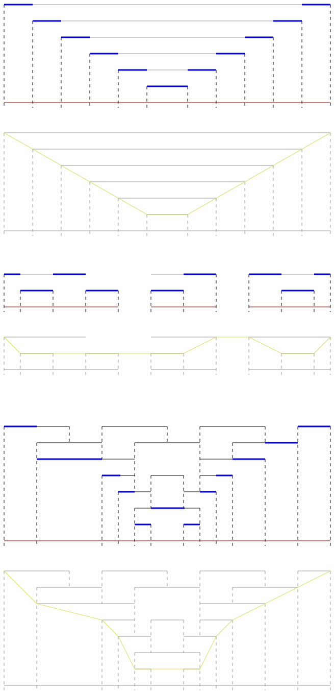

# Interval Composition
An algorithm to calculate a final set of intervals from a set of layered intervals linearly (i.e., from left to right).

Interval sets can be created and stored. Intervals are stored in a forward-only linked list.

When an interval is modified, a traversal of all the points up to the point of change occurs; points outside of the range are not recalculated.

The sets of intervals below are composed intervals with the calculated path shown below each example.



### Execution time

The main algorithm, the calculation of the final line, uses a toggle state for each layer.

The time taken to calculate is fixed (O(n)) relative to the number of points.

The space taken for state during calculation is one true/false value per layer.

### Pseudocode

```
    from first to last node, ordered by position first and ascending lane second:
    if not closing:
        if not open in any higher lane:
            if final opened:
                close final.
            open final.
        open in this lane.
    if closing:
        closed in this lane.
        if final opened:
            if not open in any higher lane:
                close final.
    if not final opened:
        if at last lane of position, except for the last position:
            if open in any other lane:
                open final.
```
